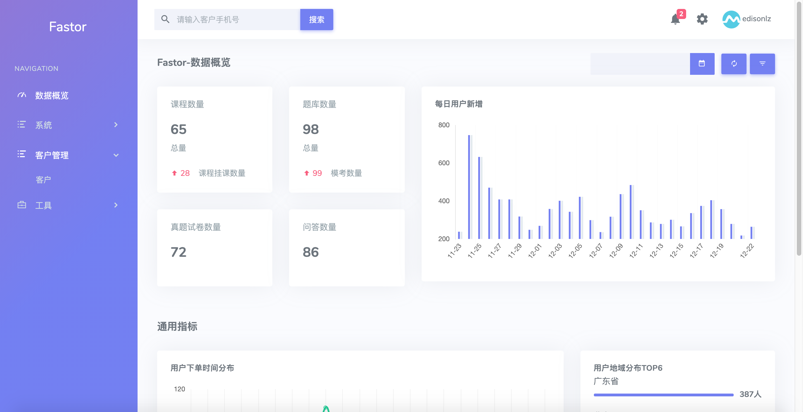

# 欢迎使用Python 服务端开发 Fastor 框架

**Fastor**是一款专为Python 打造的API与后端管理系统 Framework，通过精心的设计与技术实现，集成了大部分稳定开发组件，memcache ， redis，tornado，django，mysql 等。特点概述：
 
- **功能丰富** : 支持大部分服务器组件，支持API Doc；
- **得心应手** : 简单的实例，非常容易上手；
- **代码自动生成** : 根据定义的model模型，自动生成增删改查代码。
- **性能优先** :  API使用Tornado开发，性能极高。
- **稳定服务** :  django和tornado经过深度优化，例如:链接自动重连等。


-------------------

## 开始使用
## Fastor 分为2个系统

### 1）后端管理系统


### 2）API系统


-------------------

## 环境配置
##### 部署服务
- 下载或者clone fastor 代码

## 框架结构
##### API 目录结构
- api: API 接口代码
- app: ORM Model与后端Views代码
- background: 分布式异步处理Async代码 & 定时任务
- base: 基类和一些帮助函数
- base/site-packages: 这里优先使用的是代码中的 site-packages 的python第三方类库

## 一 后端管理系统
#####  1）
#####  base/settings配置
- 创建数据库fastor_db
- 配置数据库连接参数
- 配置redis连接参数
- 配置memached连接参数
- 其他配置等
``` python
示例
'default': {
                'ENGINE': 'django.db.backends.mysql',
                'NAME': 'fastor_db',  # Or path to database file if using sqlite3.
                'USER': 'root',  # Not used with sqlite3.
                'PASSWORD': '123456',  # Not used with sqlite3.
                'HOST': '127.0.0.1',  # Set to sempty string for localhost. Not used with sqlite3.
                'PORT': '3306',  # Set to empty string for default. Not used with sqlite3.
                'CHARSET': 'utf8',
                'OPTIONS': {
                    'init_command': 'SET storage_engine=INNODB; SET SESSION TRANSACTION ISOLATION LEVEL READ COMMITTED;set autocommit=1;',
                },
            },
```
#####  app/settings配置
- 配置应用(app) 如第一次使用默认配置即可


##### 2）配置成功后，同步数据库并运行演示程序
``` python
cd app/
python manager.py syncdb #同步数据库并创建管理员
python runserver #启动服务
open http://127.0.0.1:8000/ ， 并使用刚创建的管理员账号密码登录
```


##### 3）创建自己的 models
 #####  1. 在目录 iclass/models/中创建model文件，例如 user.py
 #####  2. 在 iclass/models/__init__中导入 user 中的model对象
 #####  3. 示例
``` python


class BaseUser(models.Model):
    """
    用户
    """

    user_id = models.CharField(max_length=32, verbose_name=u'用户ID', default='',primary_key=True)
    username = models.CharField( max_length=11, verbose_name=u'用户名', default='')
    nickname = models.CharField(max_length=20, verbose_name=u'昵称', default='')
    password = models.CharField(max_length=100, verbose_name=u'密码', default='')
    image_url = models.CharField( max_length=255, verbose_name=u'用户头像', default='')
    sex = models.IntegerField( verbose_name=u'性别', default='1')
    email = models.CharField( max_length=50, verbose_name=u'邮箱', default='' )
    status = models.IntegerField( verbose_name=u'状态', default='0' )  # 0-关闭，1-开启
    register_from = models.IntegerField(verbose_name=u'注册设备', default='0', choices=RegisterFromChoices)
    last_login_time =  models.DateTimeField(auto_now_add=True, verbose_name=u'最后登录时间')
    create_time = models.DateTimeField(auto_now_add=True, verbose_name=u'创建时间')
    
    class Meta:
        app_label = "iclass"
        db_table = "user"
        verbose_name = u"客户"

```

#####  4）.执行自动生成view/templates代码  python manage.py gencode iclass.models.base_user BaseUser
     - 这里将会在views和templates自动生成增删改查的代码
     - 填下urls规则
     - 导入views/__init__.py
     - 设置入口导航 iclass/templates/cms_index/left_side_menu.html
     


## 后台系统服务部署
#####  1.执行 bash app/app.sh 执行进程的数量，端口号均在这里配置。


##### 作者： 向Ed老师曾经的战友们致敬！

